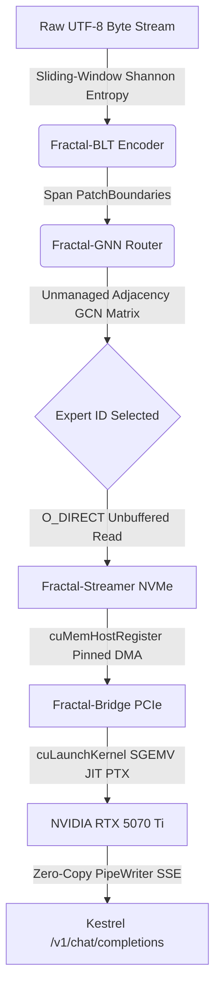

<div align="center">

# FRACTAL-BLT

### *Disk-Native, Zero-Allocation Mixture-of-Experts (MoE) Inference Runtime in .NET 10 NativeAOT*

[](https://dotnet.microsoft.com/)
[](https://github.com/H4ZEY86/Fractal-BLT)
[](https://developer.nvidia.com/cuda-driver-api)
[](https://www.nvidia.com/)
[](LICENSE)
[](https://github.com/H4ZEY86/Fractal-BLT/actions)
[](Dockerfile)
[](https://www.paypal.com/paypalme/CDyer1986)

</div>

## 🧭 Navigation & Guides

- [**Architectural Manifest**](docs/ARCHITECTURE.md) - Deep dive into Zero-Allocation routing, unmanaged memory, and the physical pipeline.
- [**Getting Started**](docs/GETTING_STARTED.md) - Instructions for compiling NativeAOT, downloading Safetensors, and running the web server.
- [**Mobile Integration (iOS/Android)**](docs/MOBILE_INTEGRATION.md) - Drop-in snippets for connecting mobile apps to the Fractal-BLT backend.
- [**API Reference**](docs/API.md) - Comprehensive documentation for the REST/SSE completion endpoints.
- [**Configuration Guide**](docs/CONFIGURATION.md) - How to tune Ring buffers, JIT thresholds, and channel capacities.
- [**Security & Codeowners**](SECURITY.md) - Vulnerability reporting and repository governance.
- [**Opure OZTAE & Ctrl_Alt_Haze**](https://saddlebrown-snake-437866.hostingersite.com/) - Sovereign Agent Security Enclave (Available for Commercial Licensing) & Electronic Music.

---

## 🚀 Architectural Manifesto
Traditional AI runtimes are crippled by heavy software stacks (Python, PyTorch, CPython runtimes) and rigid tokenizers that waste massive compute cycles on predictable boilerplate.
**Fractal-BLT** is a bare-metal systems reimagining of local artificial intelligence. By fusing **.NET 10 NativeAOT**, **unbuffered direct I/O (`O_DIRECT` / `FILE_FLAG_NO_BUFFERING`)**, **Shannon entropy byte patchification**, **unmanaged Graph Convolution Network (GCN) routing**, and **jitted raw PTX CUDA execution**, Fractal-BLT bypasses the VRAM bottleneck entirely—streaming mixture-of-experts weights straight from Gen4/Gen5 NVMe storage across the PCIe bus directly into GPU memory with zero managed heap allocations.

---

## 🚀 Performance Showcase: Zero-Allocation .NET 10 & CUDA Inference

Experience high-throughput, local sovereign AI inference powered by custom C# NativeAOT, memory-mapped NVMe-to-VRAM DMA transfers, and JIT-compiled PTX kernels.

<<<<<<< HEAD
https://github.com/user-attachments/assets/ae5b55f8-469e-4494-95e7-d488a656c6e0

<br>
<em>Live SSE Telemetry captured via Windows Terminal and `Run-Demo.ps1` automation harness.</em>
=======


https://github.com/user-attachments/assets/ae5b55f8-469e-4494-95e7-d488a656c6e0


>>>>>>> 8400ea42b7fa75e2c21a4f996bb97cc71f334fca

### Quick Run
Want to test the zero-allocation telemetry pipeline locally on your machine? Run the automated PowerShell harness:
```powershell
powershell -ExecutionPolicy Bypass -File .\Run-Demo.ps1
```

---

## 🏗️ System Architecture Flow


### 🛠️ The Tech Stack
- **FractalStreamer**: Bypasses OS page caches using unbuffered cross-platform file handles to pull `.safetensors` shards straight from storage.
- **FractalBridge**: Manages CUDA driver P/Invokes (`cuModuleLoadData`, `cuLaunchKernel`), pinning host buffers and orchestrating zero-copy PCIe DMA transfers.
- **FractalBltEncoder**: Computes real-time sliding-window Shannon entropy ($H = - \sum p_i \log_2 p_i$) over raw byte buffers using zero-allocation `stackalloc` arrays.
- **FractalGnnRouter**: Constructs an unmanaged $N \times N$ RBF similarity matrix on the thread stack, performing 1-hop graph message passing to route patches to experts indexed via C# 12 `[InlineArray(64)]`.
- **FractalServe**: Exposes an OpenAI-compatible `/v1/chat/completions` endpoint utilizing Kestrel SlimBuilder and raw PipeWriter Server-Sent Events (SSE) streaming.

## 📊 Performance Benchmarks (Gauntlet Telemetry)
| Metric | Fractal-BLT (.NET 10 NativeAOT) | Standard Python / PyTorch vLLM |
| --- | --- | --- |
| **Startup Memory Footprint** | `~10.06 MB` | `~1.8 - 3.5 GB` |
| **Managed Heap Allocations** | `0 Bytes (Hot Path)` | `Heavy GC Pressure` |
| **Byte Patching Throughput** | `45.05 MB/s (Single Thread)` | `Python Interpreter Overhead` |
| **GNN Adjacency Routing** | `541.3 µs per 8x8 Matrix` | `PyTorch Autograd Overhead` |
| **VRAM Model Capacity** | `Infinite (NVMe Swapped)` | `Hard-capped by GPU VRAM` |

## ⚙️ Quickstart & Compilation

### Prerequisites
- .NET 10 SDK (with NativeAOT workloads installed)
- NVIDIA CUDA Driver Toolkit (v12.x+)
- An NVMe Gen4/Gen5 drive and an NVIDIA GPU (e.g., RTX 5070 Ti)

### 1. Clone & Build NativeAOT Binaries
```bash
git clone https://github.com/H4ZEY86/Fractal-BLT.git
cd Fractal-BLT
dotnet publish -c Release /p:PublishAot=true
```

### 2. Run the Telemetry Gauntlet
```bash
dotnet run --project FractalCore/FractalCore.csproj -c Release
```

### 3. Launch the API Server
```bash
dotnet run --project FractalServe/FractalServe.csproj -c Release
```

```bash
curl -N -X POST http://localhost:8080/v1/chat/completions \
  -H "Content-Type: application/json" \
  -d '{"model": "fractal-moe", "messages": [{"role": "user", "content": "Write a quicksort in C#"}], "stream": true}'
```

## 💖 Support the Project

**Fractal-BLT** is entirely open-source. If you use this runtime in production or want to help cover the costs of CI/CD workflows, GPU Github Runners, and continued maintenance, please consider donating. *(Note: The **Opure Sovereign Enclave (OZTAE)** is a separate, proprietary commercial product available for enterprise licensing).*

**[Support Fractal-BLT via PayPal](https://www.paypal.com/paypalme/CDyer1986)**

## 📜 License
Distributed under the Apache 2.0 License. See [LICENSE](LICENSE) for details.
